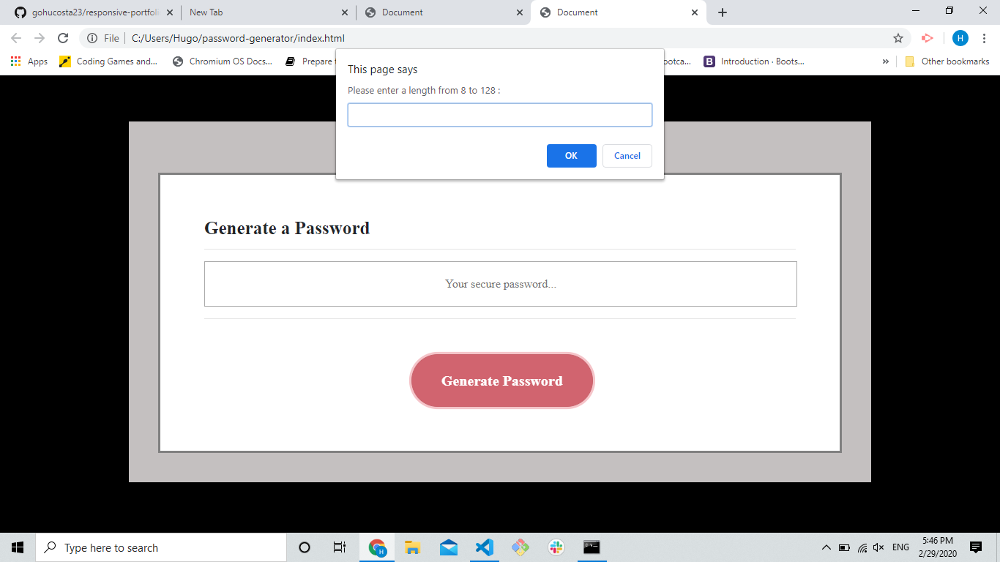
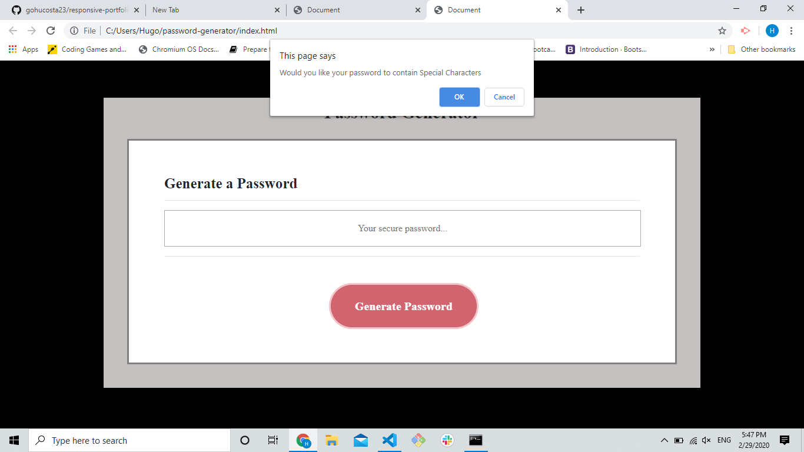
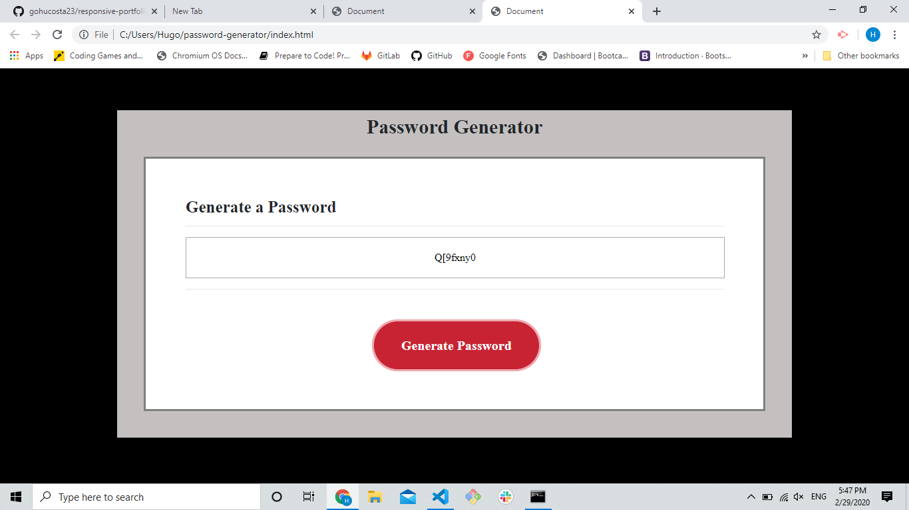

#Password Generator
 

## Introduction

This is my first JavaScript project. In this project you will see the use of many different variables and conditions.

## General Info

THis is a simple Password Generator that allows the user to choose the length of the password (from 8 to 128 characters), also, it allows them to choose and combine from 4 different criterias (Lower Case letters, Upper Case Letters, Numbers and Special Chasracters). I will give you a better look at these features on instructions.

##Instructions

<ol>

<li>In order to generate password, the user will click on the "Generate Passord" button, and immediatelly will receive a prompt asking to enter the desired length. If they choose they choose a less than 8 or more than 128 characters the program will ask them to start over.
 

</li>
  

 <li>Then they will be asked if they want Lower case letters, Upper Case letters, Numbers and Special Characters. If they click "Ok" the option will be added, otherwise the password will exclude the options they don't want.
  

</li>
 

<li>After all they choose all the criterias the password will be generated.
 

</li>
 

<li>Also, the application will be available for use on screens of all size. 
 

## Conclusion

I know I have been working with JavaScript for about 2 weeks, but this project so far has been the most difficult one... It took me a while to make it work and at the end I still wonder if there was an easier way to do this... 